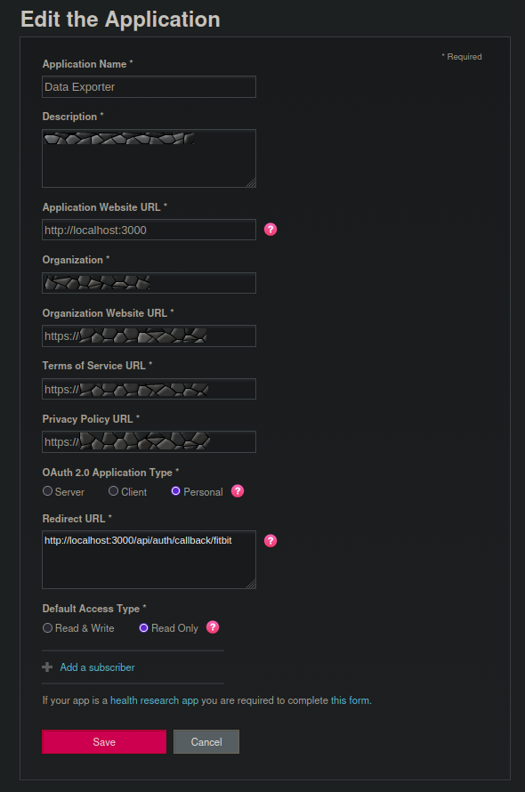

# Fitbit Workout Exporter

A simple, local web application that allows you to export your Fitbit activities as **TCX files**. This is useful for migrating your data to other platforms like Strava, Garmin Connect, or TrainingPeaks.

Works with all activity types, not just GPS tracked ones (the only ones Fitbit sends to Strava).

## Features

-   **Secure Authentication**: Log in with your Fitbit account using OAuth 2.0.
-   **Activity List**: View your recent workouts with details (Date, Type, Duration).
-   **TCX Export**: Download valid TCX files for your activities, including GPS and Heart Rate data (if available).

## Setup Instructions

To run this application, you need to register an app on the Fitbit Developer Portal to get your API credentials.

### 1. Create Fitbit App

1.  Go to [dev.fitbit.com/apps](https://dev.fitbit.com/apps) and sign in.
2.  Click **Register an App**.
3.  Fill in the form with the following details (see screenshot below):
    -   **Application Name**: Any name (e.g., "My Workout Exporter")
    -   **Description**: Any description.
    -   **Application Website URL**: `http://localhost:3000`
    -   **Organization**: Any name.
    -   **Organization Website URL**: `http://localhost:3000`
    -   **OAuth 2.0 Application Type**: **Personal** (⚠️ **IMPORTANT**: Must be "Personal" to access Intraday data like Heart Rate/GPS).
    -   **Callback URL**: `http://localhost:3000/api/auth/callback/fitbit`
    -   **Default Access Type**: Read Only.



4.  Save and note down your **OAuth 2.0 Client ID** and **Client Secret**.

### 2. Configure Application

1.  Clone or download this repository.
2.  Create a file named `.env.local` in the root directory.
3.  Add your credentials:

```env
NEXT_PUBLIC_FITBIT_CLIENT_ID=your_client_id_here
FITBIT_CLIENT_SECRET=your_client_secret_here
NEXTAUTH_SECRET=any_random_string_here
NEXTAUTH_URL=http://localhost:3000
```

## Running Locally

### Option 1: Using Node.js (Standard)

1.  Install dependencies:
    ```bash
    make install
    # or: npm install
    ```

2.  Start the development server:
    ```bash
    make run-local
    # or: npm run dev
    ```

3.  Open [http://localhost:3000](http://localhost:3000) in your browser.

### Option 2: Using Docker

1.  Ensure Docker and Docker Compose are installed.
2.  Run the application:
    ```bash
    make run-docker
    # or: docker-compose up --build
    ```
3.  Open [http://localhost:3000](http://localhost:3000) in your browser.
4.  To stop the container:
    ```bash
    make stop-docker
    ```

## License

MIT
